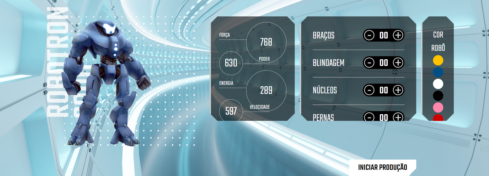

# <h1 align="center">Site Robotron 2000</h1>
 

<h2 align="center"> Descrição do Projeto </h2>
 

    Site desenvolvido pelo instrutor da Alura quem ministrou o curso "JavaScript: manipulando o DOM". 
     
    A publicação deste site foi efetuada neste repositório GitHub para demonstrar os conhecimentos adquiridos quando manipula-se objetos em JavaScript.

 

<h2 align="center"> :hammer:  Ferramentas e Funcionalidades  :hammer: </h2>
 

      

 

    Ao clicar no botão com o sinal de "+" ou de "-" no menu dos itens/recursos de robô, a quantidade deles é atualizada automaticamente, assim como os cálculos de força, poder, energia e velocidade. 
 
Também é possível alterar as cores do robô, clicando na cor no menu correspondente.

 
          
<h2 align="center"> :notebook:  O que Aprendi  :notebook:</h2>

 - Interação do JavaScript com HTML e CSS.
 - Utilizar o JavaScript numa página real
 - Tornar uma página dinâmica
 - Manipular dados, eventos e elementos com JavaScript
 - Explorar, criar e declarar funções no JavaScript
 
 
 
<h2 align="center"> :heart:  Contato  :heart:</h2>
 

regothardo@gmail.com
